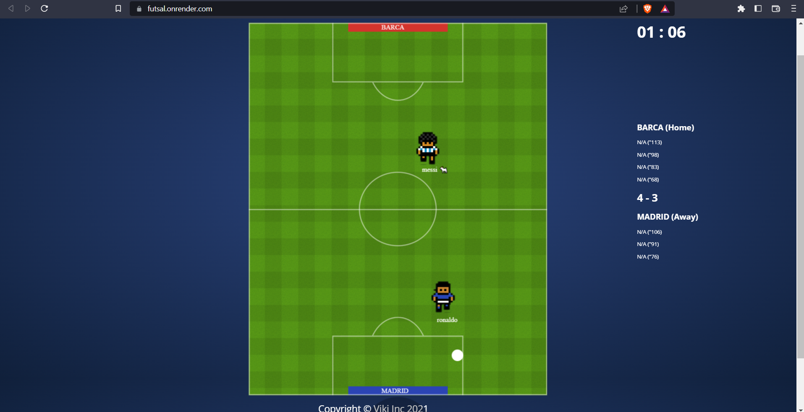

# futsal

A 3v3 multiplayer football like game using websockets, nodejs, and jQuery

## Setup

```
git clone
npm install
npm start
```

## Live-Demo



Play the game with your friends [here](https://futsal.onrender.com)

## ToDo

1. Improve ball & player movement mechanics
2. Improve performance
3. Fix break in iOS safari

## License

This project and its contents are open source under the [MIT License](https://github.com/darekkay/dashboard/blob/master/LICENSE)
